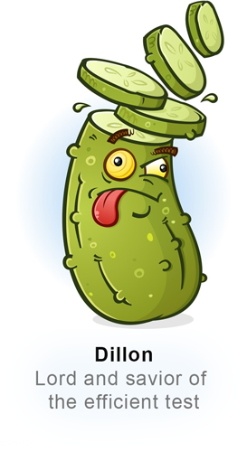

# Dill 
##### *Seasons cucumber and pickle*


 
This project aims to improve speed to create BDD-style cypress testcases. A set of predefined steps can be used to
 perform the most common operations in testing like clicking, typing and verifying the existance of elements.
 
 ### Example
 
 Imagine this BDD Scenario inside a feature:
 ````gherkin
    Scenario: Activate Authorisation for George Online Trading 
        When I go to my securities page
        And I activate the authorisation
        Then I see the securities risk waiver
````

Each individual step would require a step definition written in JS. However using Dill, we can implement each step with 
more gherkin languages.

The step `I activate the authorisation` can be implemented using this definition in our `.steps`-file:

```gherkin
Step: I activate the authorisation
	When I scroll to the bottom of the page
	And I click the "Activate Button" inside the "Activate Authorisation Panel"
```

Cypress now can automatically interpret those two sub-steps.

Dill is built on top of the grammar of picklejs. 
All available phrases can be found here:  [Phrases](https://www.picklejs.com/docs/phrases)

### Installation 

#### 1. Install package
Currently this package is not published via npm. Therefore it needs to be included via git:

```ecma script 6
// package.json
{
    // ...
    "dependencies": {
        // ...
        "dill": "git+ssh://git@github.beeone.at:George/dill.git"
    }
}
```
#### 2. Update `cypress.json`
Next we need to specify where Dill can find our `.steps` file and put the compiled result.

````ecma script level 4
// cypress.json
{
    // ...
    "stepDefinitions": "**/*.steps",
    "stepDefinitionTemp": "cypress/steps-compiled.json"
}
````

#### 3. Load the Plugin
Make sure the following plugins get loaded:

```ecmascript 6
const cucumber = require('cypress-cucumber-preprocessor').default;
const {
  addMatchImageSnapshotPlugin,
} = require('cypress-image-snapshot/plugin');

const dill = require('dill');

module.exports = (on, config) => {
  addMatchImageSnapshotPlugin(on);
  on('file:preprocessor', cucumber());
  dill();
};

```

#### 4. Start testing!
Create your first `.steps` file under the previously defined location in `cypress.json`.

